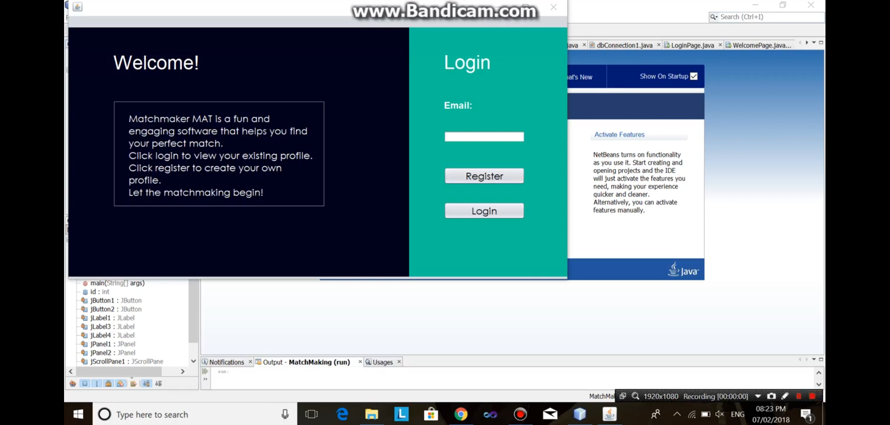

# MATCHMAKING SOFTWARE
### 2nd year 1st semester's Java Project 
It was a matrimonial platform where individuals could get suggested candidates according to their likes and dislikes. 
Platform: Java Swing, 
Language: Java

An image of the project is shown below.

Tasks that can be performed by this app are:
* Login page  

* Match page  

* Form Sample page  

Demonstration of registration is given <a href="https://youtu.be/jMX4etQ5stk">Here</a>. 
Demonstration of matchmaking is provided <a href="https://youtu.be/4Kia6x89bUg">Here</a>.

